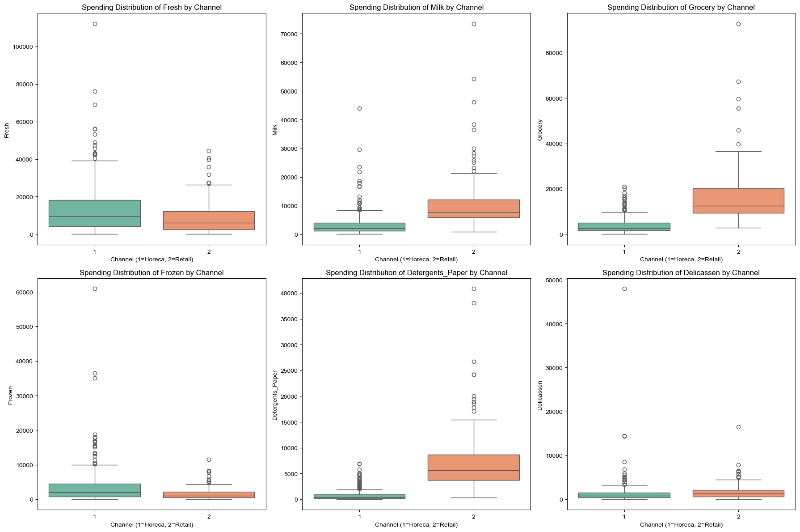
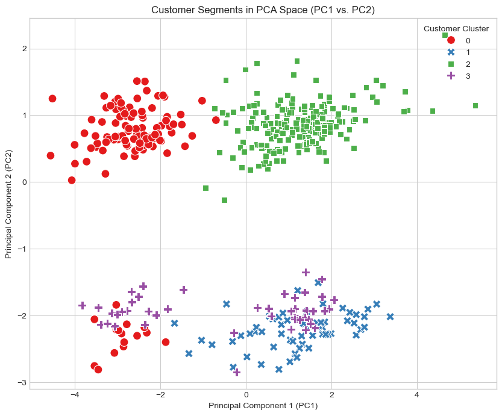
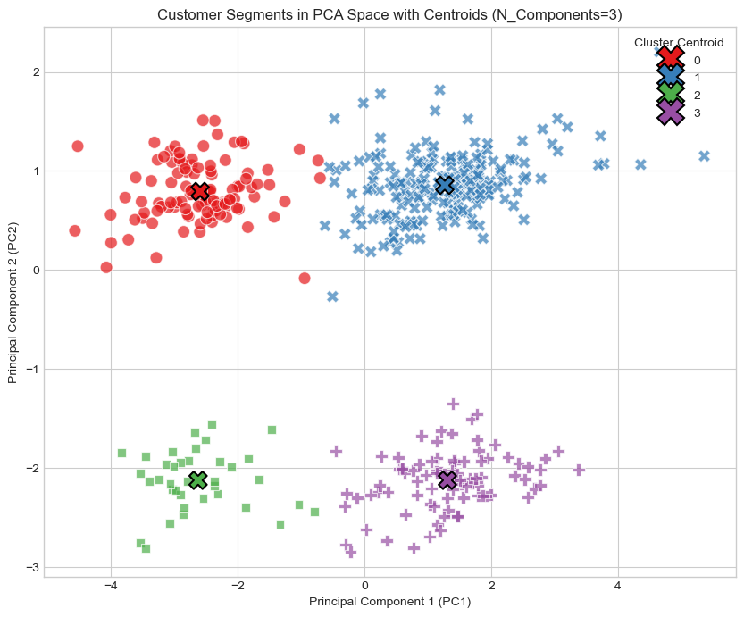

# Goal 

This project focuses on utilizing advanced Unsupervised Machine Learning to segment a wholesale distributor's customer base based on spending patterns across six critical product categories. The primary goal is to move beyond basic classification (like the known Horeca/Retail split) and discover four distinct, data-driven segments that offer actionable insights for targeted inventory management, marketing, and pricing strategies. The analysis is built upon a rigorous comparative study between the optimized K-Means Clustering algorithm and the Gaussian Mixture Model (GMM).

---

# Project Background

A large wholesale distributor operates within a complex market, serving clients categorized broadly by their Channel (Horeca for hotels/restaurants, and Retail). However, successful strategic planning—including optimized inventory, targeted marketing, and predictive sales forecasting—requires a deeper, more granular understanding than these broad labels allow. Customers within the same channel often exhibit wildly different spending habits across the six major product categories.

This analysis addresses the critical business challenge of heterogeneous customer behavior by answering core strategic questions:

- Behavioral Differentiation: What are the underlying, distinct spending patterns that define unique customer segments, independent of the known Channel label?
- Resource Allocation: Which segments represent high-value opportunities versus high-volume commodity opportunities?
- Model Validation: How effective are advanced unsupervised algorithms (Optimized K-Means and GMM) in uncovering these hidden structures compared to simple Channel classification?

By systematically transforming the data, and rigorously comparing clustering algorithm performance, this project provides the distributor with a data-driven segmentation strategy for immediate, actionable business intelligence.

---

# Interpretation of Clusters

1. Horeca Segments (Clusters 1 and 3): These are clearly defined by their reliance on Fresh and Frozen goods and their minimal use of commodities (Detergents_Paper is 700 vs. 6,800 for Retail). The key difference is the Fresh vs. Frozen mix, which dictates logistics and speed requirements.

2. Retail Segments (Clusters 0 and 2): These are defined by extremely high proportional spending on Milk, Grocery, and Detergents_Paper. The segmentation here successfully identifies the commodity buyers who drive the highest volume in non-perishables.

3. Validation of k=4: The model successfully split the two known channels into two distinct segments each, showing that within the Horeca group, the Fresh vs. Frozen reliance is the most important behavioral differentiator.

--- 

## Machine Learning Model Evaluation

This project utilized two unsupervised clustering algorithms, **K-Means** and **Gaussian Mixture Model ($\text{GMM}$)**, on the final optimized feature space ($N=3$ PCA components). Models were evaluated based on their internal coherence ($\text{Silhouette Score}$) and their alignment with the available business ground truth ($\text{Channel}$ label) using the **Adjusted Rand Index ($\text{ARI}$)**.

### Final Model Performance Summary ($\mathbf{N=3}$ Components, $\mathbf{k=4}$ Clusters)

| Metric | K-Means (Optimized) | Gaussian Mixture Model (GMM) | Interpretation |
| :--- | :---: | :---: | :--- |
| **Silhouette Score** (Internal Cohesion) | **0.4845** | 0.4818 | Higher score indicates tighter, better-separated clusters. K-Means is marginally superior in overall segment tightness. |
| **Adjusted Rand Index (ARI)** (External Relevance) | **0.5347** | 0.5083 | Measures similarity between predicted clusters and the original `Channel` labels. K-Means provides stronger alignment with the underlying business structure. |
| **Optimal Cluster Count ($\mathbf{k}$)** | 4 (from Elbow/Silhouette) | 4 (from BIC Minimum) | Both models agreed on 4 being the optimal number of segments for this data. |

### Conclusion

The final evaluation confirmed that the optimized **K-Means model** is the most effective solution for this dataset. While both models were highly effective, K-Means provided superior performance across both key metrics, validating its selection as the primary segmentation strategy.

---

# Recommendations 

The four segments primarily delineate two major customer groups (Horeca and Retail) and two critical smaller segments that define specific strategic opportunities:

- Segment 1: Core Horeca (High Fresh): This cluster is highly pure, defined by extreme spending on Fresh products. Action: Focus inventory and delivery logistics for rapid, high-volume fresh goods supply.

- Segment 2: Primary Retail (High Grocery/Detergents): This large segment represents the core retail client, characterized by high spending across Grocery and Detergents_Paper. Action: Target these clients with bulk discounts and long-term contracts for commodity items.

- Segment 3: Delicatessen Niche: A distinct, smaller segment with disproportionately high spending on Delicassen products, suggesting specialized or premium food service clients. Action: Offer specialized product lines and personalized account management.

- Segment 4: Balanced Middle Ground: A mixed segment with moderate, balanced spending across all categories. Action: Target cross-selling campaigns to increase spending in one dominant category (e.g., offer incentives to move them toward Frozen or Fresh specializations).

---

## Visualisations 

1. Data Exploratory Analysis 

2. Initial Plot (N = 6, k = 4)

3. Optimized Plot (N = 3, k = 4)

---

## Challenges Faced and Solutions 

1. Data Skewness and Scale

- Challenge: The raw spending data (e.g., Fresh vs. Detergents) exhibited massive differences in scale and severe right skewness, violating the assumptions of both K-Means and GMM algorithms and biasing results towards high-variance features.
- Solution: Implemented a two-step preprocessing pipeline: Log Transformation (log(x+1)) to normalize the highly skewed spending distributions, followed by Standard Scaling across all features to ensure equal weighting in the PCA and clustering distance calculations.

2. PCA Dimensionality (N) Optimization

- Challenge: The standard 90% explained variance rule of thumb suggested using N=6 PCA components. However, this yielded a sub-optimal cluster quality (Silhouette Score≈0.398) because the extra components introduced noise into the clustering distances.
- Implemented a rigorous optimization step: Instead of relying on the rule of thumb, PCA was iteratively tested using different component counts (e.g., N=3,4,6,8) while holding k=4 fixed. This empirical tuning successfully identified N=3 as the optimal dimensionality, resulting in a 21.5% improvement in clustering quality (Silhouette Score of 0.4845).

3. Algorithm Selection and Validation

- Challenge: The project required justifying the choice of K-Means over a more advanced model, as K-Means is based on the restrictive assumption of spherical clusters.
- Solution: Performed a direct comparative study against the Gaussian Mixture Model (GMM), which handles elliptical clusters. GMM's optimal k was determined using the Bayesian Information Criterion (BIC)

4. Cluster Interpretation
- Challenge: The final clusters were derived from abstract PCA components, making direct business interpretation (profiling) difficult for non-technical users.
- Solution: Engineered a solution by linking the final cluster labels back to the original, non-transformed data frame. This allowed the final segments to be profiled using mean spending in original currency (Fresh, Milk, etc.), creating clear, actionable profiles for business strategy.

---

## Technologies Used

- Programming Language: Python
- Data Manipulation and Analysis: Pandas and Numpy
- Machine Leaning Model: Scikit-learn (sklearn);
    - Preprocessing: StandardScaler for normalization
    - Dimensionality Reduction: PCA for optimizing the feature space from N=6 down to N=3
    - Clustering Models: KMeans and GaussianMixture (GMM) for core segmentation
    - Evaluation Metrics: silhouette_score and adjusted_rand_score (ARI) for model validation.
- Data Visualisations: Matplotlib, Seaborn

---

## Author
Mr. Pakkapol Satthapiti | MSC of Data Science and AI | The University of Liverpool | Feel free to connect!